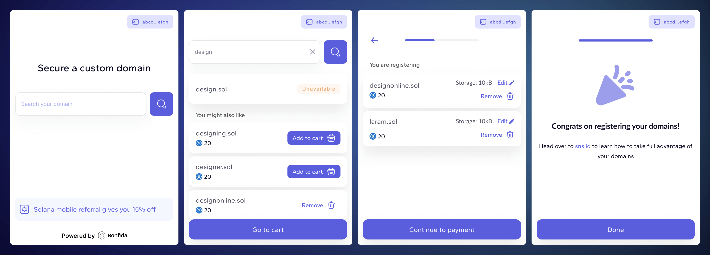

<h1 align="center">SNS Widget</h1>
<br />
<p align="center">

</p>
<p align="center">
<a href="https://twitter.com/bonfida">

</a>
</p>

<br />

<div align="center">


</div>

<p align="center">
    <a href="https://github.com/Bonfida/sns-widget/actions"></a>
    <a href="https://github.com/Bonfida/sns-widget/blob/main/LICENSE"></a>
</p>

<br />

This widget allows users to seamlessly purchase domain names in the Solana ecosystem, directly from any website that integrates this React component. Built for ease of use and flexibility, the widget interfaces with the Solana Name Service (SNS) and can be customized to fit the style and branding of your website.

Visit our Demo / Playground over at https://bonfida.github.io/sns-widget/



## Getting started

- [Demo](https://bonfida.github.io/sns-widget/)
- [Usage example](https://github.com/Bonfida/sns-widget/blob/main/src/app.tsx)
- Step by step 👇

### 1. Installation

Install the widget using npm:

```sh
npm install @bonfida/sns-widget
```

Or using Yarn:

```sh
yarn add @bonfida/sns-widget
```

### 2. Usage

#### Scenario 1: Default usage

By default you only need to import component and styles, and use it inside your app. The only required prop is `endpoint` for the Solana RPC Connection. Under the hood, the widget will create a connection for the specified `endpoint`. In addition, all the most popular wallets are supported by default.

Here is a basic example of how to integrate widget into your React application:

```tsx
import Widget from "@bonfida/sns-widget";
// Apart from the component itself, you also need to import styles separately
import "@bonfida/sns-widget/style.css";

// Link to public RPC for Solana connection. Solana provides free public RPCs
// with rate limiters, so you might want to use your own RPC Node provider
const PUBLIC_RPC = "https://api.mainnet-beta.solana.com";

export const Component = () => {
  return <Widget endpoint={PUBLIC_RPC} />;
};
```

#### Scenario 2: Customize your widget

The Solana Domain Purchase Widget is designed with flexibility in mind, providing several customization options to fit your unique needs:

1. **Custom Connection**: Instead of using the endpoint prop, you can pass a connection object directly. This is particularly useful for implementing additional authentication methods required by your application's connection to the Solana blockchain.

2. **Wallet Integration**: Take control of the wallet functionality by passing your wallet directly into the widget. This allows you to decide which wallets to support and manage wallet interactions seamlessly.

3. **Theme Management**: With the isDark prop, you can toggle the widget's theme to dark mode, enabling a user-friendly interface that aligns with your site’s design scheme.

4. **Styling with CSS Variables**: Customize the widget's appearance by modifying CSS variables linked to the .sns-bw class, which is the root class of the widget. For dark mode styles, target the .sns-bw.dark class.

5. **Referral Program**: By passing a referral public key, you can enable transaction sharing with referrers. The smart contract ensures that only valid referrers are rewarded. [Read more](https://docs.bonfida.org/collection/programs/referral-program).

6. **Partner Branding**: Showcase your partnership by integrating your logotype within the widget, highlighting your brand to your users.

Here is an example of how to use features described above:

```tsx
import Widget from "@bonfida/sns-widget";
// Apart from the component itself, you also need to import styles separately
import "@bonfida/sns-widget/style.css";

import { useConnection, useWallet } from "@solana/wallet-adapter-react";
import { useWalletModal } from "@solana/wallet-adapter-react-ui";

// Here you can modify all the widget colors by editing existing variables (example in the next code block):
import "./custom-widget-theme.css";

export const App = () => {
  return (
    <ConnectionProvider>
      <WalletProvider wallets={wallets} autoConnect>
        <WalletModalProvider>
          <Page />
        </WalletModalProvider>
      </WalletProvider>
    </ConnectionProvider>
  );
};

export const Page = () => {
  const wallet = useWallet();
  const { setVisible, visible } = useWalletModal();
  const { connection } = useConnection();

  const { isDark } = useCustomProjectContext();

  return (
    <Widget
      connection={connection}
      passthroughWallet={{
        setVisible,
        visible,
        ...wallet,
      }}
      isDark={isDark}
      rootWrapperClassNames={"right-[80px] z-[100] your-custom-class"}
      partnerLogo={<YourLogoComponent />}
    />
  );
};
```

```css
/*
  In some cases you might need to increase selector specificity to override default styles.

  The best option is to pass some class to `rootWrapperClassNames` and use it here like:
  .your-custom-class.sns-bw {}

  But in general, it's just CSS, so you can achieve this in any way.
*/

.sns-bw {
  /*
   You need to provide colors exactly in that format.
   It represents R,G,B numeric values, similar to rgb(52, 152, 219), but only numbers.
  */
  --theme-primary: 52, 152, 219;
  --background-primary: 255, 255, 255;
}
.sns-bw.dark {
  --theme-primar: 231, 76, 60;
}
```

### List of props

| Prop Name               | Type                     | Description                                                                             |
| ----------------------- | ------------------------ | --------------------------------------------------------------------------------------- |
| `endpoint`              | `string`                 | The network endpoint URL for the Solana blockchain services.                            |
| `connection`            | `Connection`             | A Solana web3 connection instance.                                                      |
| `passthroughWallet`     | `WalletPassThroughProps` | Props to pass through to the wallet component for additional configuration.             |
| `containerClassNames`   | `string`                 | CSS class names to apply to the widget container for custom styling.                    |
| `containerStyles`       | `CSSProperties`          | Inline styles to apply to the widget container.                                         |
| `rootWrapperClassNames` | `string`                 | CSS class names to apply to the root wrapper of the widget for custom styling.          |
| `rootWrapperStyles`     | `CSSProperties`          | Inline styles to apply to the root wrapper of the widget.                               |
| `isDark`                | `boolean`                | Toggles the dark mode appearance of the widget.                                         |
| `referrerKey`           | `PublicKey`              | Public key for referral tracking to create a share of the transaction for the referrer. |
| `partnerLogo`           | `ReactNode`              | React node to display a partner’s logo within the widget interface.                     |

## Upcoming features/improvements

- [ ] Experiment separate bundle for passthroughWallet
- [ ] Framework-agnostic implementation
- [ ] Usage via CDN
- [ ] Improved theming customization
